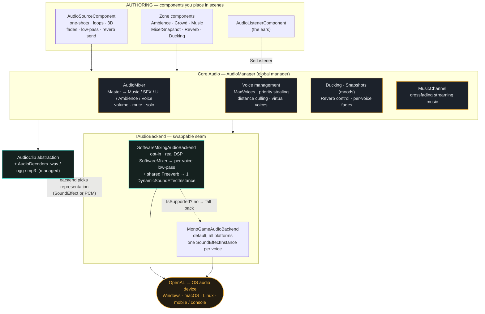
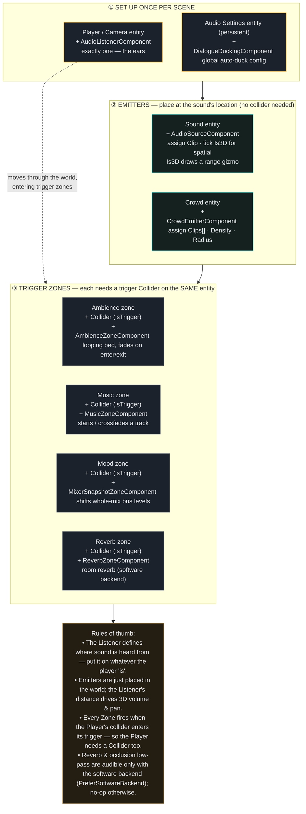

# Voltage Engine — Audio System Docs

Documentation for the engine's audio system (mixer, spatial, zones, voice management, backends & DSP).

- **Feature overview (visual):** [`audio-features.html`](audio-features.html) — open in a browser. Also hosted at
  <https://claude.ai/code/artifact/02b90ad8-b89c-4750-b015-fc0daf327876>.
- **Diagram sources:** [`audio-architecture.mmd`](audio-architecture.mmd), [`audio-setup.mmd`](audio-setup.mmd)
  (Mermaid — both are embedded below so they render on GitHub).

---

## 1. Architecture — internal signal flow

How audio flows from the components you place, through the `AudioManager`, to the swappable backend and the OS.



---

## 2. Setup — which entity gets which components

The practical composition guide for a game project.



---

## Enabling the software backend (DSP)

Reverb and occlusion low-pass require the software mixing backend. It's opt-in and set **before** the
`AudioManager` is constructed (there's a commented line in `Voltage.Editor/Program.cs`):

```csharp
Voltage.Audio.AudioManager.PreferSoftwareBackend = true;
```

It probes the platform and falls back to the MonoGame backend automatically where unsupported; DSP is then a
harmless no-op. Watch the console for a `[Audio] Using SoftwareMixingAudioBackend…` line to confirm.
