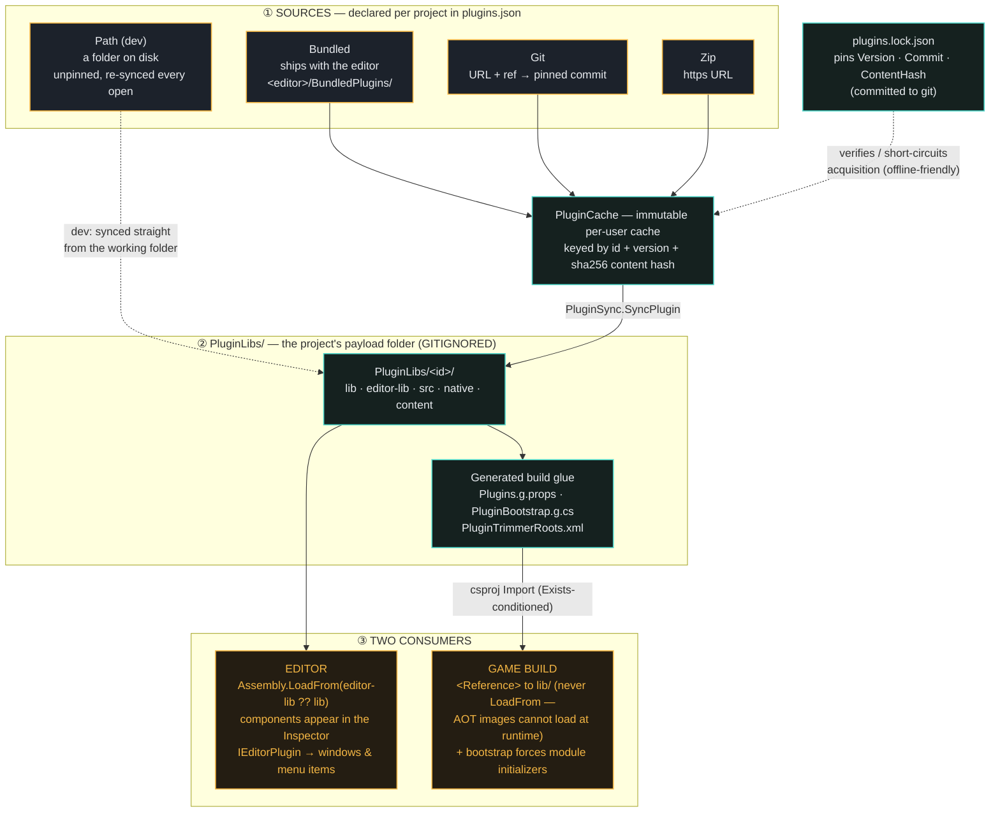
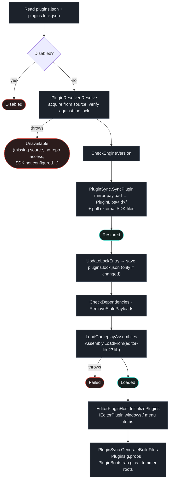

# Voltage Engine — Plugin System Docs

Documentation for the engine's plugin system (packages, sources, the lockfile, editor vs. game loading,
external SDKs, and authoring your own).

A **plugin** is a self-contained folder with a `plugin.json` manifest at its root. It can contribute
gameplay code (DLLs or plain `.cs` sources), native libraries, content, and editor tooling. The bundled
**Farseer Physics** plugin is the reference example — the whole `FS*` component family ships as a plugin.

---

## 1. Architecture — how a plugin reaches the editor and the game

Plugins are **acquired** from a source, **cached** immutably per-user, **synced** into the project, and then
consumed by two very different hosts: the editor (which loads DLLs at runtime) and the game build (which
statically references them so they survive NativeAOT).



**The key asymmetry:** the editor can `Assembly.LoadFrom` a DLL at runtime; a published NativeAOT game
cannot. So the game gets plugins as *static MSBuild references* compiled into the image, plus a generated
bootstrap that forces each plugin's `[ModuleInitializer]` registrations to run.

---

## 2. Anatomy of a plugin package

The manifest sits at the package root and points at the folders it uses. Everything is optional except
`plugin.json` itself.

```
my-plugin/
├── plugin.json              # the manifest (required)
├── lib/                     # gameplay DLLs — net8.0, built WITHOUT the EDITOR symbol
├── editor-lib/              # optional EDITOR-flavored twins of lib/ (first-party engine modules only)
├── editor/                  # editor-plugin DLLs — reference Voltage.Editor.dll, implement IEditorPlugin
├── src/                     # source-form gameplay code, compiled together with the game's Scripts/
├── native/<rid>/            # per-RID native libraries (win-x64, osx-arm64, …)
└── content/                 # runtime content copied into the game build's Content folder
```

You ship **either** `lib/` (prebuilt) **or** `src/` (source-form). Source-form is simpler — the `.cs` files
just compile into the game — and its generated module initializers run natively, so it needs no bootstrap
entry. Prebuilt is what you want for closed-source or slow-to-compile code.

---

## 3. `plugin.json` — manifest reference

All JSON keys are **PascalCase** (`Voltage.Persistence.Json` matches field names directly).

### Top level

| Field | Type | Notes |
| --- | --- | --- |
| `SchemaVersion` | int | Currently `1`. |
| `Id` | string | **Required.** Stable, reverse-domain (`voltage.farseer`, `com.studio.fmod`). Never change it — it's the identity everywhere. |
| `Name` | string | Display name in the Plugin Manager. |
| `Version` | string | Semver (`1.2.0`). |
| `Description` | string | Shown in the Plugin Manager's Description column. |
| `Author` | string | Optional vendor name. |
| `Kinds` | string[] | **Required.** `"gameplay"` and/or `"editor"`. Decides which sections below must be present. |
| `EngineVersion` | string | Supported engine range — `"*"`, `">=0.1.0"`, `">=0.1.0 <0.2.0"`. A mismatch **warns only**; the plugin still loads. |
| `EditorPluginApiVersion` | int | Hard-checked for editor plugins — a mismatch means `Failed`. Ignored for gameplay-only plugins. |
| `Dependencies` | object[] | `{ "Id": "...", "Version": ">=1.0.0" }` — checked against the other plugins in the project. **Not auto-installed:** a dependency that isn't listed in `plugins.json` (or is disabled/unavailable/out of range) just makes *this* plugin `Unavailable`. |
| `Gameplay` | object | Required when `Kinds` contains `"gameplay"`. |
| `Editor` | object | Required when `Kinds` contains `"editor"`. |
| `ExternalSdks` | object[] | SDKs the user installs themselves (see §7). |

### `Gameplay`

| Field | Type | Notes |
| --- | --- | --- |
| `ManagedAssemblies` | string[] | Package-relative DLLs shipped into the game (runtime flavor, no `EDITOR` symbol). |
| `EditorManagedAssemblies` | string[] | Optional `EDITOR`-flavored twins of the above, same assembly names. The editor loads **these instead** when present. Only first-party engine modules with `#if EDITOR` sites need this. |
| `SourceRoots` | string[] | Folders whose `.cs` files compile together with the game's `Scripts/`. |
| `RootTypes` | string[] | One namespace-qualified public type per managed assembly. The generated bootstrap uses it to root the assembly for AOT and force its module initializers. **Auto-detected when omitted.** |
| `TrimmerRootAssemblies` | string[] | Assembly simple names preserved wholesale from trimming. Defaults to the names in `ManagedAssemblies`. |
| `Natives` | object[] | `{ "Rid": "win-x64", "Files": ["native/win-x64/*.dll"] }`. Layout convention is `native/<rid>/`. |
| `Content` | string[] | Copied into the game build's `Content/` folder. **Caveat:** only the *first path segment* is honored — `"content/**"` copies the whole `content/` tree recursively, preserving paths relative to it. The rest of the glob is ignored, so don't rely on it to filter. |

### `Editor`

| Field | Type | Notes |
| --- | --- | --- |
| `Assemblies` | string[] | Editor-plugin DLLs containing `IEditorPlugin` implementations (windows, menu items). |

### The real thing — bundled Farseer

```json
{
	"SchemaVersion": 1,
	"Id": "voltage.farseer",
	"Name": "Farseer Physics",
	"Version": "1.0.0",
	"Description": "Full rigid-body physics engine (Box2D-lineage Farseer) with the FS* component family: FSRigidBody, FSCollisionBox/Circle/Polygon, joints, and FSWorld.",
	"Kinds": ["gameplay"],
	"EngineVersion": "*",
	"Gameplay": {
		"ManagedAssemblies": ["lib/Voltage.FarseerPhysics.dll"],
		"EditorManagedAssemblies": ["editor-lib/Voltage.FarseerPhysics.dll"],
		"RootTypes": ["Voltage.Farseer.FSRigidBody"],
		"TrimmerRootAssemblies": ["Voltage.FarseerPhysics"]
	}
}
```

The manifest is **validated on load** (`PluginManifest.Validate`): every file it references must actually
exist in the package, or the plugin goes `Unavailable` with a user-facing message. The one exception is
files that an external SDK pull is expected to produce.

---

## 4. The three project files

| File | Committed? | Written by | Purpose |
| --- | --- | --- | --- |
| `plugins.json` | **yes** | you / Plugin Manager | The wish list: which plugins this project wants, and from where. |
| `plugins.lock.json` | **yes** | the editor | The pins: exactly what was resolved (version, commit, content hash). |
| `PluginLibs/` | **no — gitignored** | the editor | The materialized payloads + generated build glue. Regenerated on project open. |

`plugins.json` — the source of truth you edit:

```json
{
	"SchemaVersion": 1,
	"Plugins": [
		{
			"Id": "voltage.farseer",
			"Source": { "Bundled": true, "Git": null, "Ref": null, "Zip": null, "Path": null },
			"Dev": false,
			"Disabled": false
		}
	]
}
```

Exactly **one** of `Bundled` / `Git` / `Zip` / `Path` must be set.

> ### ⚠️ `PluginLibs/` must be gitignored
>
> It holds locally-built DLLs, generated MSBuild glue, and — for external-SDK plugins — **NDA-protected
> files that must never enter a repository**. It is 100% reproducible from `plugins.json` +
> `plugins.lock.json`, so there is nothing to gain by committing it and quite a lot to lose.
>
> New projects get the rule automatically (`ProjectStructureGenerator.CreateGitIgnoreFile`). If you have an
> older project where it's tracked, fix it once:
>
> ```sh
> git rm -r --cached PluginLibs
> printf '\nPluginLibs/\n' >> .gitignore
> ```
>
> The csproj's `Import` of `Plugins.g.props` is `Exists`-conditioned, so a fresh clone without `PluginLibs/`
> builds fine — but **open the project in the editor once** before building the game from an IDE, so the
> glue gets regenerated.

---

## 5. Lifecycle — what happens when a project opens

`PluginManager.RestoreForProject` runs this sequence. Every plugin is independent: one bad plugin never
blocks the project from opening.



**States** (`PluginState`): `Disabled` · `Restored` (payload synced) · `Loaded` (assemblies in the editor) ·
`Unavailable` (couldn't acquire/verify) · `Failed` (acquired, but loading blew up).

A game build refuses to start if any plugin is `Unavailable` or `Failed` (`PluginSync.SyncForBuild`) —
silently shipping a game missing a plugin its scenes depend on is worse than a red build.

> **Plugin assemblies never unload.** They're `Assembly.LoadFrom`'d into the **default** `AssemblyLoadContext`,
> not a collectible one. So enabling, disabling, updating, or removing a plugin takes effect in the editor only
> after you **reopen the project** (or restart the editor). The Plugin Manager says as much when you act. Dev
> plugins are the exception for *source* changes — those hot-reload (see §9).

Removing a plugin is non-destructive to your scenes: entities keep their component data as
missing-component entries, and re-adding the plugin restores them. Nothing is silently dropped on save.

---

## 6. The four sources

| Source | Acquired from | Pinned by | Cached? |
| --- | --- | --- | --- |
| **Bundled** | `<editor>/BundledPlugins/<folder>/` | editor `Version` | n/a — read in place |
| **Path** | a folder on disk | *(nothing — see Dev mode)* | no |
| **Git** | `git` URL + `Ref` (tag/branch/SHA) | resolved `Commit` + `ContentHash` | yes |
| **Zip** | https URL | `ContentHash` | yes |

Git, Zip, and non-dev Path payloads are hashed and copied into an immutable per-user cache at
`<storage root>/PluginCache/<id>/<version>+<first-8-of-hash>/` — cross-project, written once. On the next
open, if the lock pins that exact payload and the cache already holds it, resolution short-circuits with
**no network access at all** — offline-friendly by design. A hash that doesn't match the lock is a **hard
error**: the payload changed underneath a pin, which is exactly what a lockfile exists to catch.

The hash is sha256 over each file's lowercased relative path plus its raw bytes, files sorted ordinally,
with `.git/` and `.DS_Store` excluded — so the *same* payload fetched via git and via zip hashes identically.

**Git uses your own `git` CLI** on `PATH`, with your ambient credentials (SSH agent, credential helper). The
editor never handles a token, which is precisely what lets a private/NDA plugin repo work with zero
credential plumbing. The `Ref` (tag, branch, or SHA) is resolved to a **full commit SHA** and that SHA is
what goes in the lock — so a force-pushed tag can never silently hand your teammates different code.

**Zip** accepts both common layouts: `plugin.json` at the archive root, or nested inside a single top-level
folder (GitHub's "Download ZIP" shape).

**Bundled plugins are deliberately not content-pinned.** Their payload is compiled by the editor build on
each machine, and .NET assemblies embed absolute source paths, so the bytes — and therefore the hash —
differ per machine. Recording that hash would make `plugins.lock.json` churn on every clone. They pin on the
editor-provided `Version` instead (`ResolvedPlugin.IsPinnable = false`).

---

## 7. External SDKs (FMOD, console SDKs, anything under NDA)

Some SDKs cannot be redistributed. A plugin declares them, and the files are pulled from the *user's own*
install at sync time — they never enter the package, the cache, or git.

```json
"ExternalSdks": [
	{
		"Id": "fmod",
		"DisplayName": "FMOD Engine",
		"EnvVar": "FMOD_SDK",
		"Required": true,
		"Pulls": [
			{ "From": "api/core/lib/x64/fmod.dll", "To": "native/win-x64/" }
		]
	}
]
```

The path resolves from the per-user setting (`PluginSdk_<Id>`, set in the Plugin Manager) or falls back to
`EnvVar`. A `Required` SDK that isn't configured makes the plugin **Unavailable** with a message telling the
user exactly what to set. Pulls re-run on *every* sync — the user may configure the path after the first
open — and afterwards every manifest-listed file is verified to actually exist, so a pull list that lies is
a loud failure rather than a mysterious one later.

This is the reason `PluginLibs/` being gitignored is a correctness requirement, not a tidiness preference.

---

## 8. Editor vs. runtime assemblies

Engine modules sometimes need editor-only code (gizmos, inspector hooks) behind `#if EDITOR`. That means two
builds of the same assembly:

- `lib/Foo.dll` — the runtime flavor, **no** `EDITOR` symbol. This is what ships in the game.
- `editor-lib/Foo.dll` — same assembly name, compiled **with** `EDITOR`. The editor loads this one when it
  exists, falling back to `lib/` otherwise.

Third-party plugins almost never need `editor-lib/` — it exists for first-party engine modules like Farseer,
whose `BuildBundledPlugins` target in `Voltage.Editor.csproj` compiles the project twice (`Release` and
`Editor-Release`) into the two folders.

For the **game**, `PluginSync.GenerateBuildFiles` writes `PluginLibs/Plugins.g.props` with a `<Reference>`
per managed assembly and a `TrimmerRootDescriptor` per plugin, and `PluginBootstrap.g.cs` with a
`[ModuleInitializer]` that calls `RunModuleConstructor` on each root type. That last part is subtle and worth
knowing: on CoreCLR a bare `typeof(X)` does **not** trigger a module initializer (ECMA-335 runs them on first
static-member access or method invocation), so without the explicit call, a plugin's component registrations
would silently never happen.

---

## 9. Authoring a new plugin

The fastest path is **Plugin Manager → Create New Plugin…**, which scaffolds the folder and manifest for you.
By hand, the minimum source-form plugin is two files:

```
my-plugin/
├── plugin.json
└── src/
    └── MyComponent.cs
```

```json
{
	"SchemaVersion": 1,
	"Id": "com.studio.myplugin",
	"Name": "My Plugin",
	"Version": "1.0.0",
	"Kinds": ["gameplay"],
	"Gameplay": { "SourceRoots": ["src"] }
}
```

Then add it to the project as a **Path** source with `Dev: true` and iterate — your `.cs` files compile
straight into the game alongside `Scripts/`, and components show up in the Inspector like any other.

Components in a plugin follow the same two rules as components in `Scripts/`: the class must be `partial`
(the source generator emits AOT-safe serialization into the other half), and it should carry a
`[ComponentId("…")]` — the stable on-disk identity that survives class and namespace renames. Get that wrong
and scenes will lose their data on the next rename.

To graduate to a prebuilt plugin, build your code to a `net8.0` DLL, drop it in `lib/`, and swap
`SourceRoots` for `ManagedAssemblies`. Add `RootTypes` only if auto-detection picks the wrong type. Your
assembly's simple name must not collide with an engine DLL or another plugin's — that's a hard failure, since
one would otherwise silently shadow the other.

### Editor plugins (`"Kinds": ["editor"]`)

An editor plugin ships DLLs in `editor/` that reference `Voltage.Editor.dll` and expose a public class with a
parameterless constructor implementing **`IEditorPlugin`**:

```csharp
void Initialize(IEditorPluginContext context);  // register windows / menu items; throwing disables the plugin
void Shutdown();                                // project close or editor exit
```

`IEditorPluginContext` hands you `RegisterWindow(EditorPluginWindow)`, `AddMenuItem(path, onClick)` (a `/`
nests submenus, e.g. `"FMOD/Event Browser"`), the `ImGuiManager`, the `CurrentProject`, and a `ProjectClosing`
event. `EditorPluginWindow` is abstract — you override `Title` and `Draw()`, and own your own `ImGui.Begin`/
`End` (pass `ref IsOpen` to `Begin`).

The editor plugin API is **explicitly unstable**. `EditorPluginApiVersion` in the manifest is hard-checked
against the editor's — a mismatch puts the plugin in `Failed` rather than crashing the editor. Note the Create
wizard can't auto-add an editor plugin to a project, because its DLL doesn't exist until you build it: build
first, then add the folder.

### Dev mode (`"Dev": true`)

For a Path source, dev mode is the live-edit workflow. It means:

- **Unpinned.** No `ContentHash` is recorded and any stale pin is dropped from the lockfile — no hash
  verification ever runs, so you're never fighting the lock while iterating.
- **No cache copy.** The payload folder *is* your working folder.
- **The editor compiles your sources straight from the working folder**, not the `PluginLibs` mirror — so
  edits take effect without waiting for a re-sync.
- **Hot reload.** `ScriptWatcher` watches dev plugin source roots (and only those); saving a `.cs` recompiles
  like any game script.
- **Writable.** Non-dev plugin sources are treated as immutable installs, so the ComponentIdStamper won't
  rewrite them; dev sources it will.
- Game builds re-mirror dev plugins right before building, so the build always sees your latest code.

---

## 10. The Plugin Manager window

`Plugins → Plugin Manager`. From here you can:

- **Add Plugin** — pick a source: bundled (dropdown), local folder, git URL + ref, or zip URL.
- **Create New Plugin…** — scaffold a fresh plugin package (`plugin.json` + starter code), optionally adding
  it to the project as a live-edit (dev) plugin.
- **Enable / Disable** — flips `Disabled` in `plugins.json` without removing the entry.
- **Update** — re-resolves the source (latest ref / zip content / folder) and re-pins `plugins.lock.json`.
  Offered for any non-bundled, non-dev plugin; bundled plugins version with the editor and dev plugins
  re-sync automatically, so neither has anything to update.
- **Remove** — drops the plugin. Scenes using its components show missing-component entries; **the data is
  preserved**, so re-adding the plugin restores them.
- **Configure SDK paths** — for plugins with `ExternalSdks`.

---

## Rules of thumb

- **Commit `plugins.json` and `plugins.lock.json`. Never commit `PluginLibs/`.** It's regenerated, it's
  machine-specific, and it may contain NDA files.
- **`Id` is forever.** It keys the lockfile, the payload folder, and every scene reference. Renaming it
  orphans everything.
- **Prefer `src/` while developing, `lib/` when shipping.** Source-form needs no bootstrap and no trimmer
  roots; you can always switch later.
- **A fresh clone needs one editor open** before the game project will build with plugins from an IDE.
- **Don't hand-edit `plugins.lock.json`.** Use *Update* in the Plugin Manager, or delete the entry and
  reopen.
